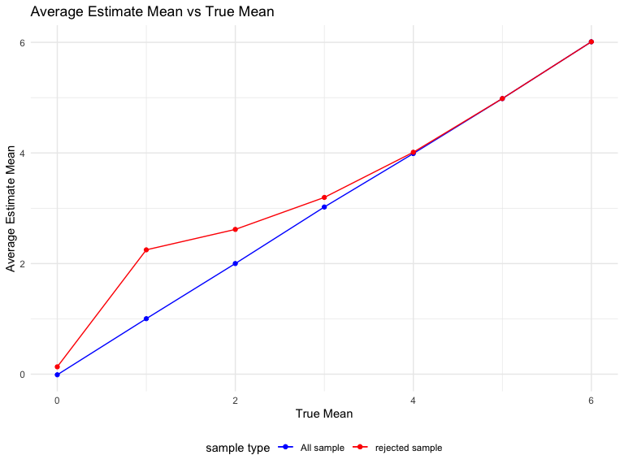

p8105_hw3_jt3387
================

## Problem 1

The code chunk below imports the data in individual spreadsheets
contained in `./data/zip_data/`. To do this, I create a dataframe that
includes the list of all files in that directory and the complete path
to each file. As a next step, I `map` over paths and import data using
the `read_csv` function. Finally, I `unnest` the result of `map`.

``` r
full_df = 
  tibble(
    files = list.files("data/zip_data/"),
    path = str_c("data/zip_data/", files)
  ) %>% 
  mutate(data = map(path, read_csv)) %>% 
  unnest()
```

The result of the previous code chunk isn’t tidy – data are wide rather
than long, and some important variables are included as parts of others.
The code chunk below tides the data using string manipulations on the
file, converting from wide to long, and selecting relevant variables.

``` r
tidy_df = 
  full_df %>% 
  mutate(
    files = str_replace(files, ".csv", ""),
    group = str_sub(files, 1, 3)) %>% 
  pivot_longer(
    week_1:week_8,
    names_to = "week",
    values_to = "outcome",
    names_prefix = "week_") %>% 
  mutate(week = as.numeric(week)) %>% 
  select(group, subj = files, week, outcome)
```

Finally, the code chunk below creates a plot showing individual data,
faceted by group.

``` r
tidy_df %>% 
  ggplot(aes(x = week, y = outcome, group = subj, color = group)) + 
  geom_point() + 
  geom_path() + 
  facet_grid(~group)
```


This plot suggests high within-subject correlation – subjects who start
above average end up above average, and those that start below average
end up below average. Subjects in the control group generally don’t
change over time, but those in the experiment group increase their
outcome in a roughly linear way.

## Problem 2

Load the data.

``` r
homicide_raw <- read_csv("https://raw.githubusercontent.com/washingtonpost/data-homicides/master/homicide-data.csv")
```

Description of the raw data:

-   The data set contain 52179 observations and 12 variables.

-   The key variables are: `uid` represents the identity of every
    record, `reported_data` represents the date when the homicide was
    reported, `victim_last` and `victim_first` show the last and first
    name of the victim, `victim_race`, `victime_age`, `victim_sex` show
    the race, age, and gender of the victim, `city` and `state`
    represents which city and state the homicide happened, `lat` and
    `lon` represent the latitude and longitude coordinates of the
    homicide, `disposition` represents the result of the homicide.

-   `victim_age` is a character variable, and there are NAs and
    `unknown` values in it. I’ll invert it into numeric. There are also
    NAs in `lat` and `lon` variables. There is a row with Tulsa as city
    and AL as state seems to have an error, so I’ll remove this row.

Create the `city_state` variable.

``` r
homicide <- homicide_raw %>% 
  mutate(victim_age = as.numeric(victim_age),
         city_state = paste(city, state, sep = ", "))
homicide_city <- homicide %>% 
  group_by(city_state) %>% 
  summarize(total_homicide = n(),
            unsolved_homicide = sum(disposition == "Closed without arrest" | disposition == "Open/No arrest")) %>% 
  filter(city_state != "Tulsa, AL")
homicide_city %>% knitr::kable() 
```

| city_state         | total_homicide | unsolved_homicide |
|:-------------------|---------------:|------------------:|
| Albuquerque, NM    |            378 |               146 |
| Atlanta, GA        |            973 |               373 |
| Baltimore, MD      |           2827 |              1825 |
| Baton Rouge, LA    |            424 |               196 |
| Birmingham, AL     |            800 |               347 |
| Boston, MA         |            614 |               310 |
| Buffalo, NY        |            521 |               319 |
| Charlotte, NC      |            687 |               206 |
| Chicago, IL        |           5535 |              4073 |
| Cincinnati, OH     |            694 |               309 |
| Columbus, OH       |           1084 |               575 |
| Dallas, TX         |           1567 |               754 |
| Denver, CO         |            312 |               169 |
| Detroit, MI        |           2519 |              1482 |
| Durham, NC         |            276 |               101 |
| Fort Worth, TX     |            549 |               255 |
| Fresno, CA         |            487 |               169 |
| Houston, TX        |           2942 |              1493 |
| Indianapolis, IN   |           1322 |               594 |
| Jacksonville, FL   |           1168 |               597 |
| Kansas City, MO    |           1190 |               486 |
| Las Vegas, NV      |           1381 |               572 |
| Long Beach, CA     |            378 |               156 |
| Los Angeles, CA    |           2257 |              1106 |
| Louisville, KY     |            576 |               261 |
| Memphis, TN        |           1514 |               483 |
| Miami, FL          |            744 |               450 |
| Milwaukee, wI      |           1115 |               403 |
| Minneapolis, MN    |            366 |               187 |
| Nashville, TN      |            767 |               278 |
| New Orleans, LA    |           1434 |               930 |
| New York, NY       |            627 |               243 |
| Oakland, CA        |            947 |               508 |
| Oklahoma City, OK  |            672 |               326 |
| Omaha, NE          |            409 |               169 |
| Philadelphia, PA   |           3037 |              1360 |
| Phoenix, AZ        |            914 |               504 |
| Pittsburgh, PA     |            631 |               337 |
| Richmond, VA       |            429 |               113 |
| Sacramento, CA     |            376 |               139 |
| San Antonio, TX    |            833 |               357 |
| San Bernardino, CA |            275 |               170 |
| San Diego, CA      |            461 |               175 |
| San Francisco, CA  |            663 |               336 |
| Savannah, GA       |            246 |               115 |
| St. Louis, MO      |           1677 |               905 |
| Stockton, CA       |            444 |               266 |
| Tampa, FL          |            208 |                95 |
| Tulsa, OK          |            583 |               193 |
| Washington, DC     |           1345 |               589 |

Use the `prop.test` function to estimate the proportion of homicides
that are unsolved for Baltimore, MD.

``` r
baltimore_df <- homicide_city %>%
  filter(city_state == "Baltimore, MD") 
baltimore_test <- prop.test(x = baltimore_df$unsolved_homicide, 
                            n = baltimore_df$total_homicide) %>%
  broom::tidy() 
baltimore_test %>%
  select(estimate, conf.low, conf.high) %>% 
  knitr::kable()
```

|  estimate |  conf.low | conf.high |
|----------:|----------:|----------:|
| 0.6455607 | 0.6275625 | 0.6631599 |

-   From the test result, we can see that the proportion of homicides
    which were unsolved was around 64.6% in Baltimore, MD, and the 95
    percent confidence interval is (0.6276, 0.6632).

Run prop.test for each of the cities in the data set.

``` r
ptest_tidy <- function(x, n){
  result <- prop.test(x = x, n = n) %>% 
    broom::tidy() %>% 
    select(estimate, conf.low, conf.high)
  result
}
citys_ptest <- homicide_city %>%
  mutate(result_df = purrr::map2(.x = unsolved_homicide, .y = total_homicide, ~ptest_tidy(x = .x, n = .y))) %>% 
  unnest(result_df)
citys_ptest %>% knitr::kable() 
```

| city_state         | total_homicide | unsolved_homicide |  estimate |  conf.low | conf.high |
|:-------------------|---------------:|------------------:|----------:|----------:|----------:|
| Albuquerque, NM    |            378 |               146 | 0.3862434 | 0.3372604 | 0.4375766 |
| Atlanta, GA        |            973 |               373 | 0.3833505 | 0.3528119 | 0.4148219 |
| Baltimore, MD      |           2827 |              1825 | 0.6455607 | 0.6275625 | 0.6631599 |
| Baton Rouge, LA    |            424 |               196 | 0.4622642 | 0.4141987 | 0.5110240 |
| Birmingham, AL     |            800 |               347 | 0.4337500 | 0.3991889 | 0.4689557 |
| Boston, MA         |            614 |               310 | 0.5048860 | 0.4646219 | 0.5450881 |
| Buffalo, NY        |            521 |               319 | 0.6122841 | 0.5687990 | 0.6540879 |
| Charlotte, NC      |            687 |               206 | 0.2998544 | 0.2660820 | 0.3358999 |
| Chicago, IL        |           5535 |              4073 | 0.7358627 | 0.7239959 | 0.7473998 |
| Cincinnati, OH     |            694 |               309 | 0.4452450 | 0.4079606 | 0.4831439 |
| Columbus, OH       |           1084 |               575 | 0.5304428 | 0.5002167 | 0.5604506 |
| Dallas, TX         |           1567 |               754 | 0.4811742 | 0.4561942 | 0.5062475 |
| Denver, CO         |            312 |               169 | 0.5416667 | 0.4846098 | 0.5976807 |
| Detroit, MI        |           2519 |              1482 | 0.5883287 | 0.5687903 | 0.6075953 |
| Durham, NC         |            276 |               101 | 0.3659420 | 0.3095874 | 0.4260936 |
| Fort Worth, TX     |            549 |               255 | 0.4644809 | 0.4222542 | 0.5072119 |
| Fresno, CA         |            487 |               169 | 0.3470226 | 0.3051013 | 0.3913963 |
| Houston, TX        |           2942 |              1493 | 0.5074779 | 0.4892447 | 0.5256914 |
| Indianapolis, IN   |           1322 |               594 | 0.4493192 | 0.4223156 | 0.4766207 |
| Jacksonville, FL   |           1168 |               597 | 0.5111301 | 0.4820460 | 0.5401402 |
| Kansas City, MO    |           1190 |               486 | 0.4084034 | 0.3803996 | 0.4370054 |
| Las Vegas, NV      |           1381 |               572 | 0.4141926 | 0.3881284 | 0.4407395 |
| Long Beach, CA     |            378 |               156 | 0.4126984 | 0.3629026 | 0.4642973 |
| Los Angeles, CA    |           2257 |              1106 | 0.4900310 | 0.4692208 | 0.5108754 |
| Louisville, KY     |            576 |               261 | 0.4531250 | 0.4120609 | 0.4948235 |
| Memphis, TN        |           1514 |               483 | 0.3190225 | 0.2957047 | 0.3432691 |
| Miami, FL          |            744 |               450 | 0.6048387 | 0.5685783 | 0.6400015 |
| Milwaukee, wI      |           1115 |               403 | 0.3614350 | 0.3333172 | 0.3905194 |
| Minneapolis, MN    |            366 |               187 | 0.5109290 | 0.4585150 | 0.5631099 |
| Nashville, TN      |            767 |               278 | 0.3624511 | 0.3285592 | 0.3977401 |
| New Orleans, LA    |           1434 |               930 | 0.6485356 | 0.6231048 | 0.6731615 |
| New York, NY       |            627 |               243 | 0.3875598 | 0.3494421 | 0.4270755 |
| Oakland, CA        |            947 |               508 | 0.5364308 | 0.5040588 | 0.5685037 |
| Oklahoma City, OK  |            672 |               326 | 0.4851190 | 0.4467861 | 0.5236245 |
| Omaha, NE          |            409 |               169 | 0.4132029 | 0.3653146 | 0.4627477 |
| Philadelphia, PA   |           3037 |              1360 | 0.4478103 | 0.4300380 | 0.4657157 |
| Phoenix, AZ        |            914 |               504 | 0.5514223 | 0.5184825 | 0.5839244 |
| Pittsburgh, PA     |            631 |               337 | 0.5340729 | 0.4942706 | 0.5734545 |
| Richmond, VA       |            429 |               113 | 0.2634033 | 0.2228571 | 0.3082658 |
| Sacramento, CA     |            376 |               139 | 0.3696809 | 0.3211559 | 0.4209131 |
| San Antonio, TX    |            833 |               357 | 0.4285714 | 0.3947772 | 0.4630331 |
| San Bernardino, CA |            275 |               170 | 0.6181818 | 0.5576628 | 0.6753422 |
| San Diego, CA      |            461 |               175 | 0.3796095 | 0.3354259 | 0.4258315 |
| San Francisco, CA  |            663 |               336 | 0.5067873 | 0.4680516 | 0.5454433 |
| Savannah, GA       |            246 |               115 | 0.4674797 | 0.4041252 | 0.5318665 |
| St. Louis, MO      |           1677 |               905 | 0.5396541 | 0.5154369 | 0.5636879 |
| Stockton, CA       |            444 |               266 | 0.5990991 | 0.5517145 | 0.6447418 |
| Tampa, FL          |            208 |                95 | 0.4567308 | 0.3881009 | 0.5269851 |
| Tulsa, OK          |            583 |               193 | 0.3310463 | 0.2932349 | 0.3711192 |
| Washington, DC     |           1345 |               589 | 0.4379182 | 0.4112495 | 0.4649455 |

Create a plot that shows the estimates and CIs for each city.

``` r
citys_ptest %>% 
  mutate(city_state = fct_reorder(city_state, estimate)) %>% 
  ggplot(aes(x = city_state, y = estimate)) +
  geom_point() +
  geom_errorbar(aes(ymin = conf.low, ymax = conf.high)) +
  labs(title = "Proportion and 95%CI of Unsolved Homicides by City in USA",
       x = "City, State",
       y = "Proportion") +
  theme(axis.text.x = element_text(angle = 90, hjust = 1))
```


-   From the plot, we can see that Richmond, VA has the lowest rate of
    unsolved homicides and Chicago, IL has the highest rate among these
    50 cities.

## Problem 3

Create a function to save the estimated and p-value from the t-test, and
apply it to a simulation containing 5000 datasets with = 0 by using
`map` function.

``` r
ttest_tidy <- function(n_obs = 30, mu, sigma = 5) {
  x <- rnorm(n = n_obs, mean = mu, sd = sigma)
  result <- t.test(x) %>% 
    broom::tidy() %>% 
    select(estimate, p.value)
}
result_mu_0 <- expand_grid(mu = 0, iter = 1:5000) %>% 
  mutate(test_result = map(.x = mu, ~ttest_tidy(mu = .x))) %>% 
  unnest(test_result)
result_mu_0
```

    ## # A tibble: 5,000 × 4
    ##       mu  iter estimate p.value
    ##    <dbl> <int>    <dbl>   <dbl>
    ##  1     0     1   0.408   0.640 
    ##  2     0     2   0.866   0.401 
    ##  3     0     3  -0.832   0.350 
    ##  4     0     4  -1.02    0.171 
    ##  5     0     5   1.66    0.0712
    ##  6     0     6   1.18    0.198 
    ##  7     0     7  -0.776   0.439 
    ##  8     0     8   0.0810  0.930 
    ##  9     0     9   0.944   0.184 
    ## 10     0    10  -0.245   0.774 
    ## # … with 4,990 more rows

Repeat the above for = {1,2,3,4,5,6}.

``` r
results_mus = expand_grid(mu = 1:6, iter = 1:5000) %>% 
  mutate(test_result = map(.x = mu, ~ttest_tidy(mu = .x))) %>% 
  unnest(test_result)
results_mus
```

    ## # A tibble: 30,000 × 4
    ##       mu  iter estimate p.value
    ##    <int> <int>    <dbl>   <dbl>
    ##  1     1     1   2.32    0.0158
    ##  2     1     2   0.0362  0.962 
    ##  3     1     3   0.788   0.400 
    ##  4     1     4   1.05    0.275 
    ##  5     1     5   1.59    0.174 
    ##  6     1     6   0.551   0.548 
    ##  7     1     7   1.58    0.103 
    ##  8     1     8   1.53    0.144 
    ##  9     1     9   0.625   0.526 
    ## 10     1    10   1.37    0.0265
    ## # … with 29,990 more rows

Make a plot to show the proportion of times the null was rejected (the
power of the test) on the y axis and the true value of on the x axis.

``` r
results_allmu <- rbind(result_mu_0,results_mus)
results_allmu %>%
  group_by(mu) %>%
  summarise(rej_null_no = sum(p.value < 0.05),
            sim_no = n()) %>%
  mutate(rej_null_prop = rej_null_no / sim_no)  %>% 
  ggplot(aes(x = mu, y = rej_null_prop)) + 
  geom_point() + 
  geom_line() + 
  labs(title = "Null Hypothesis Rejection Proportion vs True Mean",
       x = "True Mean",
       y = "Null Rejection Proportion(Power of Test)")
```


-   From the plot, we can see that the power increases as the true
    sample mean increases. More specifically, when the true mean is in a
    low level like 1, 2, 3, the power increases rapidly as the mean
    increases, and when the true mean equals to 4, 5, 6, the power
    increases slowly to 1 as the mean increases. Therefore, there is a
    positive relationship between the effect size and power.

Make a plot showing the average estimate of on the y axis and the true
value of on the x axis in all samples and in samples for which the null
was rejected.

``` r
hat_mu_all <- results_allmu %>% 
  group_by(mu) %>% 
  summarize(hat_mu = mean(estimate))
hat_mu_rej <- results_allmu %>% 
  filter(p.value < 0.05) %>% 
  group_by(mu) %>% 
  summarize(hat_mu = mean(estimate))
ggplot(hat_mu_all, aes(x = mu, y = hat_mu, color = 'blue')) +
  geom_point() +
  geom_line() +
  geom_point(data = hat_mu_rej, aes(x = mu, y = hat_mu, color = 'red')) +
  geom_line(data = hat_mu_rej, aes(x = mu, y = hat_mu, color = 'red')) +
  scale_color_manual(name = 'sample type',
                     values = c("blue", "red"),
                     labels = c('All sample','rejected sample')) +
  labs(title = "Average Estimate Mean vs True Mean",
       x = "True Mean",
       y = "Average Estimate Mean")
```



-   From the plot, we can see that the sample average of estimated
    across tests for which the null is rejected is approximately equal
    to the true value of when the true mean equals to 0, 4, 5, and 6,
    while they are not approximately equal to each other when the true
    mean equals to 1, 2, and 3.

-   The estimated in non-reject sample is basically small, and the
    estimated in reject sample is relatively bigger. When = 0, there
    will be few reject null samples due to the random error, so the
    estimated is very similar to the true mean. When = 1, 2, 3, the
    effect size and null rejection proportion (power) is small, so the
    reject null sample is not a big part of the whole sample. Therefore,
    when we get rid of the non-reject sample, the in the reject null
    sample is going to get bigger. When = 4, 5, 6, the effect size and
    null rejection proportion (power) is big, so the reject null sample
    is a big part of the whole sample. Therefore, the in the reject null
    sample are similar to the true mean after getting rid of the
    non-reject sample.
